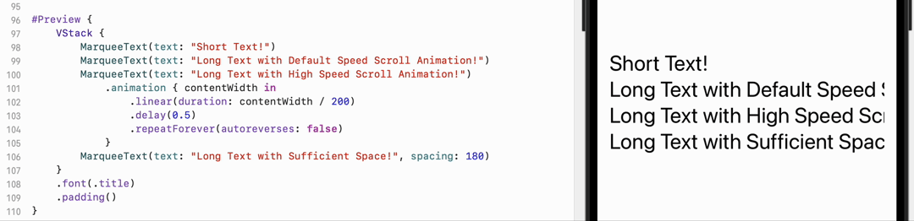

# MarqueeUI

MarqueeUI is a SwiftUI component that allows you to display auto-scrolling text within your applications.  
Inspired by the [MarqueeLabel](https://github.com/cbpowell/MarqueeLabel).



## Features
* Conditional Animation: The text does not animate if it is fully visible.
* Length-Based Animation: You can configure the animation based on the length of the text.
* Adjustable Spacing: You can adjust the spacing between the text segments.

```swift
#Preview {
    VStack {
        MarqueeText(text: "Short Text!")
        MarqueeText(text: "Long Text with Default Speed Scroll Animation!")
        MarqueeText(text: "Long Text with High Speed Scroll Animation!")
            .animation { contentWidth in
                .linear(duration: contentWidth / 200)
                .delay(0.5)
                .repeatForever(autoreverses: false)
            }
        MarqueeText(text: "Long Text with Sufficient Space!", spacing: 180)
    }
    .font(.title)
    .padding()
}
```
